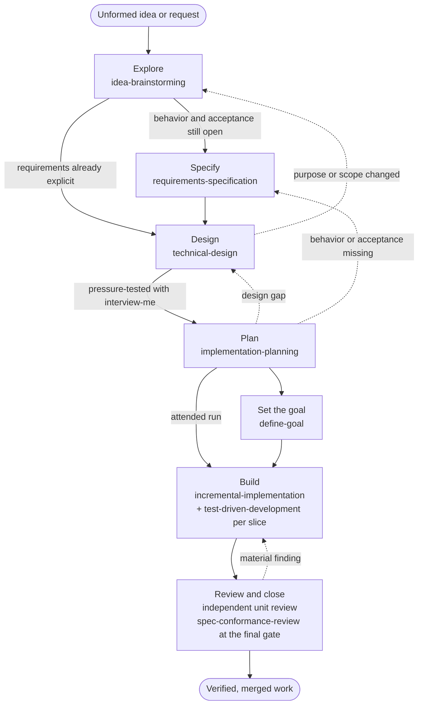

# Engineering Pipeline

This document states how the core engineering skills are meant to work together, from an unformed idea to
verified, merged work. The skills were built one at a time, and each describes its own neighbors; nothing yet
described the whole. It records intent, written on 2026-10-04 from the skills as they stood and from the user's
direction that day. It is the reference the pipeline will later be checked against, so where a skill and this
document disagree, the disagreement is a finding for that check, not a silent correction in either direction.

No agent loads this file. Agents reach the pipeline through each skill's description and the handoff each skill
names. The intended reader is whoever changes a pipeline skill or reviews the pipeline as a whole.

## The idea behind it

Each stage answers one question and leaves one artifact with its own authority. A later stage consumes an
accepted artifact and never invents what an earlier stage owns: planning does not choose architecture, design
does not decide product policy, and implementation does not quietly change the plan. When a stage finds its input
unsettled, it routes back to the stage that owns the gap instead of guessing forward.

Stages are skipped when their question is already answered. A small bounded request with explicit requirements
needs no specification, and a change that follows a settled convention needs no design document. Producing an
artifact only to fill a phase is a cost with no reader. A stage ends with a handoff: the accepted artifact, plus
one confirmation from the user that it says what they meant. That confirmation is about fidelity; it does not
authorize the next stage's work unless the user's request already did.

## The stages

| Stage      | Skill                        | Question it answers                                              | Artifact it owns                                        |
| ---------- | ---------------------------- | ---------------------------------------------------------------- | ------------------------------------------------------- |
| Explore    | `idea-brainstorming`         | What problem is worth solving, and in which direction?           | A draft marked incomplete, with one success signal      |
| Specify    | `requirements-specification` | What observable behavior counts as success, and what is out?     | The requirements specification and its acceptance       |
| Design     | `technical-design`           | How will the system realize that behavior, and how does it fail? | The design document, often in arc42                     |
| Plan       | `implementation-planning`    | In what order, verified how, and reviewed by whom?               | The implementation plan and its execution record        |
| Set a goal | `define-goal`                | What finish line will the run be held to, and how is it proved?  | The goal, set in the harness's goal loop and checkpoint |
| Build      | `incremental-implementation` | How does the change land without ever leaving the tree broken?   | Small verified commits                                  |
| Close      | `spec-conformance-review`    | Does what was built match what was specified and designed?       | Review findings in the plan's existing review record    |

**Explore** widens possibilities, then narrows to a direction. It hands to Specify when user-visible behavior or
acceptance still needs a durable contract, and straight to Design when the direction is small and its
requirements are already explicit.

**Specify** fixes intended observable behavior, actors, journeys, constraints, acceptance and non-goals. It
names no components, files or tasks; those belong downstream.

**Design** realizes the accepted behavior: architecture, interfaces, data flow, failure and recovery,
compatibility, migration and rollout. Before it hands off, `interview-me` pressure-tests its load-bearing,
hard-to-reverse decisions, and the user confirms the whole design once.

**Plan** turns the accepted design into dependency-ordered units, each with its verification and its review
stage. It places review in the work rather than at the end: before implementation, during it, after each
substantive unit, after corrections, and at final integration. When a specification governs the outcome, the
final integration gate includes `spec-conformance-review`.

**Set the goal** turns the plan's final integration gate, or a bounded request's own result, into a goal: an
objective, success criteria, the verification that proves them, boundaries, and stop conditions. It then arms
that goal in the running harness's goal loop, so an unattended run keeps working until the evidence exists. An
attended run with the user present may skip it.

**Build** lands one verified slice at a time, test-first where a focused test can state the result, keeping
every commit green and reversible.

**Close** compares the delivered behavior with the accepted specification and design, and feeds material
findings back into the plan's review record. It supplements code, security, and test review; it replaces none of
them.

## Skills used at any stage

Some skills serve every stage rather than one:

- `interview-me` reaches a shared understanding of a plan, design, problem or decision, one question at a time.
  Design uses it as its pressure test; any stage can use it when the user's intent is unclear.
- `domain-modeling` settles terms while a design is still moving, and keeps the glossary current.
- `to-questionnaire` turns a decision the user cannot answer alone into questions for whoever can.
- `test-driven-development` and `test-engineer` supply the tests: the first inside each Build slice, the second
  for strategy, regression tests, and proof that a change is really done.
- `systematic-debugging` finds a root cause when Build or Close meets a failure whose cause is unclear.
- `security-review` joins review when a change touches a trust boundary or the plan's risk calls for it.
- `writing-documentation` shapes any artifact above for its reader.
- `session-handoff`, `note-for-later`, `dispatching-subagents` and `writing-prompts` carry the work across
  sessions and lanes. No harness passes a goal to a subagent, so a brief restates the criteria its lane owns.

## Entry points

The pipeline has more than one door. A new product idea enters at Explore. A request whose behavior is already
clear enters at Design or, for a change that follows an existing convention, at Plan, where the existing
implementation serves as the design authority. A bug enters through `systematic-debugging`, then
`test-driven-development` for the failing test and Build for the fix. A request for goal-backed or autopilot work
enters at Set the goal, which sends it back to whichever earlier stage owns a missing answer.

## Tiers

Every stage skill sits in the direct tier, so each harness lists it in every session: `idea-brainstorming`,
`requirements-specification`, `technical-design`, `implementation-planning`, `define-goal` and
`incremental-implementation` under `shared/engineering/`, and `spec-conformance-review` under `shared/review/`.
So do `interview-me`, `domain-modeling`, the testing skills, `systematic-debugging` and `security-review`. Only
`to-questionnaire` among the pipeline's skills is in the lazy tier, which Codex, Copilot and Oh-My-Pi reach only
through `lazy-skills-server`. `skills/README.md` explains the two tiers.

## Questions for the pipeline check

The later check compares every pipeline skill against this document. These questions are already known to need
an answer there:

- Does each skill's own handoff name the same next stage and the same backward routes as the diagram?
- Is `spec-conformance-review` reached reliably? Planning schedules it only when a specification governs, and
  `incremental-implementation` covers the plan-less path; is any route left where accepted requirements exist
  but nothing calls it?
- Should the review stages name the independent reviewer in a portable way? Claude Code has dedicated review
  subagents, and the other harnesses have none, so the plan's "independent reviewer" may mean different things
  per harness.
- Does Set the goal belong before every unattended Build, or only when the user asks for goal-backed work, as the
  skill now says?
- Are the testing skills placed right? Build names `test-driven-development`, and planning's verification relies
  on tests, but neither stage names `test-engineer`'s "is this really done" check explicitly.
- Should a bug-fix path be its own documented route through the stages, or stay an entry point as described
  above?
