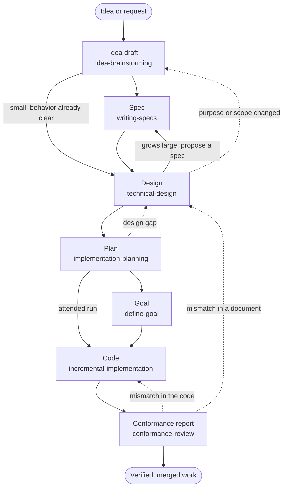

# Engineering Pipeline

This document states how the core engineering skills are meant to work together, from an unformed idea to
verified, merged work. The skills were built one at a time, and each describes only its own neighbors; this is
the one place that describes the whole. It records intent, from the user's direction on 2026-10-04. Where a skill
and this document disagree, the disagreement is a finding to resolve, not a silent correction in either
direction.

No agent loads this file. Agents reach the pipeline through each skill's description and the handoff each skill
names. The intended reader is whoever changes a pipeline skill or reviews the pipeline as a whole.

## The document chain

The pipeline is a chain of documents. Each document answers one question, is written by one skill, and is the
reference that later work is checked against. A later document never decides what an earlier one owns: the
design does not set product policy, the plan does not choose architecture, and the code does not quietly change
the plan. When a stage finds an earlier document missing or unsettled, it routes back to the skill that writes it
instead of guessing forward.

| Document           | What it is                                                               | Written by                   | Used or checked by                   |
| ------------------ | ------------------------------------------------------------------------ | ---------------------------- | ------------------------------------ |
| Idea draft         | A direction worth pursuing, with one observable sign of success          | `idea-brainstorming`         | The spec, or the design when no spec |
| **Spec**           | What the finished product must do, and how its acceptance is judged      | `writing-specs`              | Design, plan, conformance review     |
| Design             | How the system will do what the spec says, including how it fails        | `technical-design`           | Plan, conformance review             |
| Plan               | The work in dependency order, each unit with its verification and review | `implementation-planning`    | Build, conformance review            |
| Goal               | When an unattended run is finished, and the evidence that proves it      | `define-goal`                | The harness goal loop                |
| Code               | The change itself, landed as small verified commits                      | `incremental-implementation` | Unit review, conformance review      |
| Conformance report | Whether the code matches the spec, design, and plan, with every mismatch | `conformance-review`         | Closes the work, or sends it back    |

Each document ends with a handoff: the accepted document, plus one confirmation from the user that it says what
they meant. That confirmation is about fidelity; it does not authorize the next stage's work unless the user's
request already did. A document is skipped when its question is already answered, because a document written only
to fill a stage has no reader.

## The spec

The spec is the formal, written statement of what a finished product, app, tool, or feature must do: who uses it,
what they do with it, the behavior they observe, the constraints it must respect, how acceptance is judged, what
is out of scope, and who may change the spec. It names no components, files, or tasks; those belong to the design
and the plan. It is what the conformance review checks the finished work against, so without a spec the closing
check has only the design and plan to go on.

Whether to write one is the user's decision. A small change whose behavior is already clear goes straight to
design. When a design grows large, the agent proposes writing a spec first and the user decides; "large" means
the design is fixing user-visible behavior, journeys, or acceptance that nobody has written down. The spec lives
at `docs/specs/<name>.md` unless the repository has its own convention.

## Each stage

**Idea draft.** `idea-brainstorming` widens the possibilities, then narrows to a direction, and saves it as a
draft marked incomplete. It hands to `writing-specs` when user-visible behavior or acceptance needs a durable
contract, and straight to `technical-design` when the direction is small and its behavior already clear.

**Spec.** `writing-specs` turns an accepted direction into the spec described above. It is ready when a designer
can realize it without inventing product policy.

**Design.** `technical-design` decides how the system realizes the spec, or the accepted request when there is no
spec: architecture, interfaces, data flow, failure and recovery, compatibility, migration, and rollout. Before
it hands off, `interview-me` pressure-tests its load-bearing, hard-to-reverse decisions, and the user confirms the
whole design once.

**Plan.** `implementation-planning` turns the accepted design into dependency-ordered units, each with its
verification and its review stage: before implementation, after each substantive unit, after corrections, and at
final integration. The final integration gate includes the conformance review.

**Goal.** `define-goal` turns the plan's final gate, or a bounded request's own result, into a goal: an
objective, success criteria, the verification that proves them, boundaries, and stop conditions. It sets that goal
in the running harness's goal loop, so an unattended run keeps working until the evidence exists. An attended run
may skip it.

**Code.** `incremental-implementation` lands one verified slice at a time, test-first through
`test-driven-development` where a focused test can state the result, keeping every commit green and reversible.

**Conformance report.** `conformance-review` compares the delivered work with the spec, design, and plan,
classifies each mismatch by cause, and sends it to the owner: a code defect back to implementation, a gap in a
document back to the skill that writes it. It supplements code, security, and test review; it replaces none of
them.

## Review lanes

The plan names an independent review after each substantive unit and at final integration. Each harness supplies
that reviewer differently. Claude Code and Codex share the same ten subagents, `code-reviewer`,
`security-auditor`, `plan-critic`, and `test-engineer` among them. Oh-My-Pi runs eight of them and keeps its
built-in `reviewer` and `security-reviewer` in place of `code-reviewer` and `security-auditor`. Copilot CLI has
one generated custom agent, `code-reviewer`; its other review lanes run as skills in the main session.

## Skills used at any stage

- `interview-me` reaches a shared understanding of a plan, design, problem, or decision, one question at a time.
  The design stage uses it as its pressure test.
- `domain-modeling` settles terms while a spec or design is still moving, and keeps the glossary current.
- `to-questionnaire` turns a decision the user cannot answer alone into questions for whoever can.
- `test-driven-development` and `test-engineer` supply the tests: the first inside each code slice, the second for
  test strategy, regression tests, and proof that a change is really done.
- `systematic-debugging` finds the root cause when a failure's cause is unclear.
- `security-review` joins review when a change touches a trust boundary or the plan's risk calls for it.
- `writing-documentation` shapes any document above for its reader.
- `session-handoff`, `note-for-later`, `dispatching-subagents`, and `writing-prompts` carry the work across
  sessions and lanes. No harness passes a goal to a subagent, so a brief restates the criteria its lane owns.

## Entry points

The pipeline has more than one door. A new product idea starts at the idea draft. A request whose behavior is
already clear starts at the design, or at the plan when it follows an existing convention, which then serves as
the design. A bug starts with `systematic-debugging`, then `test-driven-development` for the failing test, and
then code for the fix. A request for goal-backed or autopilot work starts at the goal, which sends it back to
whichever earlier document is missing.

## Tiers

Every skill that writes a document in the chain is in the direct tier, so each harness lists it in every
session: `idea-brainstorming`, `writing-specs`, `technical-design`, `implementation-planning`, `define-goal`, and
`incremental-implementation` under `shared/engineering/`, and `conformance-review` under `shared/review/`.
So are `interview-me`, `domain-modeling`, the testing skills, `systematic-debugging`, and `security-review`. Only
`to-questionnaire` is in the lazy tier, which Codex, Copilot, and Oh-My-Pi reach through `lazy-skills-server`.
`skills/README.md` explains the two tiers.

## Where the skills do not yet match

The routing check of 2026-10-04 (agent-setup's `docs/evaluations/skills/2026-10-04-engineering-pipeline-routing.md`) compared
the skills with this intent. In practice the spec is almost never written: in a month of Claude sessions the
design skill loaded in 22 transcripts and the spec skill in 2. The conformance review loaded only when a brief
named it, so the closing check rarely runs, and no review lane carries it. Nothing yet prompts a spec when a
design grows large. The proposals that close these gaps are open decisions, recorded in that check.
