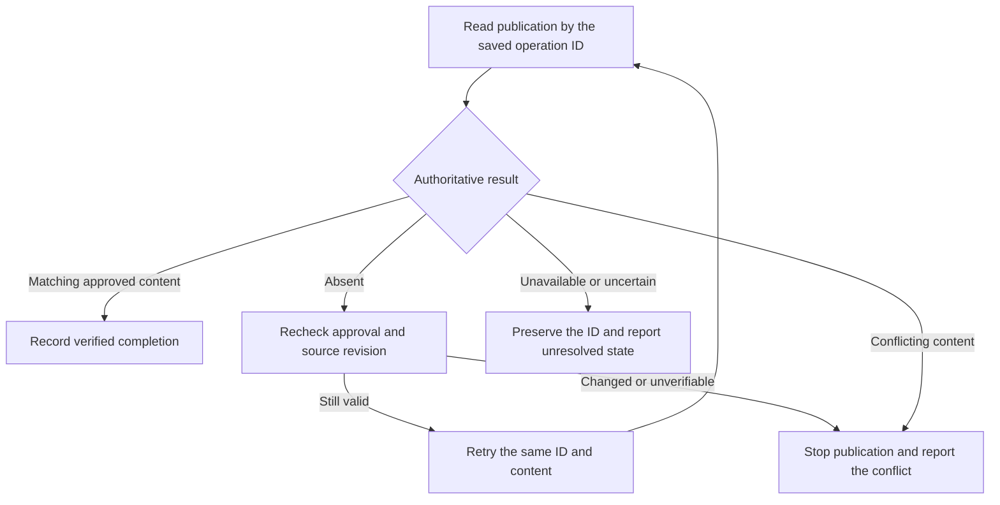

# Operational Workflow Design

Establish the behavior of consequential operations before deciding how to package their instructions and
helpers. Apply this guidance when the workflow needs to coordinate state changes, repeat an operation whose
completion is uncertain, resume later, or interact with another actor changing the same state.

A procedure that only explains supplied material can remain ordinary instructions. Document length and the
number of authoring steps do not create a need for operational machinery.

## Establish the Contract

For each consequential operation, answer the following from the task's requirements and verified tool
contracts. Group operations when they share the same conditions and recovery behavior.

| Establish                | What the author must settle                                                                                                    |
| ------------------------ | ------------------------------------------------------------------------------------------------------------------------------ |
| Authoritative state      | Name the record or service that governs the decision, how to read it, and the identity or revision the observation belongs to. |
| Entry conditions         | State what must hold before acting and when to recheck observations that may have changed.                                     |
| Allowed effects          | Name the changes this operation may make under the authority already granted.                                                  |
| Enforcement ownership    | Identify the tool, runtime, script, or person responsible for each requirement and what that owner can actually guarantee.     |
| Completion evidence      | Define the observation that proves the intended result and distinguishes it from partial or uncertain completion.              |
| Failure and continuation | Specify the response to interruption, conflicting state, and a later invocation, including the evidence needed to continue.    |

Keep the contract in the smallest form that lets an implementer act without inventing a consequential
decision. A few sentences can suffice. Where operations depend on each other, make their legal ordering and
failure exits explicit. Put the contract beside the instructions or helper interface that uses it.

## Identify What Enforces Each Requirement

Distinguish a rule the agent is expected to follow from a condition checked or enforced by a tool. Naming an
allowed effect in prose does not restrict the agent's actual permissions. Human review supplies judgment or
authorization; it does not by itself prevent an operation from running against changed input.

Prefer a verified guarantee supplied by an existing tool or runtime. State which guarantee the workflow
relies on and how the author checked it. If other actors can change the same state, determine what protects
the interval between checking a condition and acting on it. An earlier read alone does not protect that
interval.

When the available environment cannot supply a required guarantee, state the limitation and the affected
operation. Resolve it before declaring the candidate complete. Reuse existing authority; ask the user only
when the remaining choice changes the intended behavior, accepted risk, or scope.

Leave interpretive decisions with the model or person equipped to make them. The contract must state what
evidence their decision supplies and what subsequent operations may rely on it.

## Example: Publication With a Lost Acknowledgment

Suppose a report service accepts an operation ID and an approved report revision. Its verified API contract
atomically permits one publication per ID, returns the existing result for the same ID and content, and
rejects different content under that ID. It also supports authoritative lookup by ID.

The skill's contract must preserve that ID and approved revision across invocations. Source and approval
records govern what may be published; the service record governs whether publication happened. The service
enforces uniqueness. The skill must still check that the content is the approved revision and verify the
returned publication identity and content before recording completion.

If the request succeeds but its acknowledgment is lost, a later invocation follows this decision path:

A retry is safe here because the service handles repeated submissions of the same operation. A new ID would
lose that protection. Define a bounded retry policy and stop with the saved identity when it is exhausted.
If the chosen service lacks the stated guarantees, this example does not establish safety for that service;
the author must settle its actual recovery contract.

## Check Before Handoff

Walk the successful path, an interruption after a consequential effect, and a continuation against changed
state. Confirm that each path identifies the governing evidence, responsible owner, permitted next action,
and completion or stopping condition. Use safe executable checks where a tool contract needs verification,
and report which paths were only inspected. Preserve these expectations for independent review.
