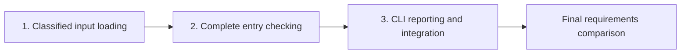

# Catalog Validator Implementation Plan

Teaching example: this plan accompanies `technical-design`'s `references/arc42-example.md`.
Locate that skill through the skill catalog. The setup below is fictional; paths and commands
illustrate a repository inspection result, not claims about the repository where this skill runs.

Status: proposed plan from the design accepted within the example. No implementation has run.

## Implementation Overview

First make input loading distinguish a catalog from an input failure. Then implement the pure
entry checker against that array contract. Finally connect both to the CLI and verify the complete
caller-facing behavior. This order exposes the error boundary before output handling depends on it.

The checker could be developed independently after its input contract is stable. For this small
change, sequential ownership keeps the shared CLI integration and review evidence simple.

## Example Repository Basis

The example assumes an existing command-line package with these inspected surfaces:

| Surface                                                           | Established role                                                                |
| ----------------------------------------------------------------- | ------------------------------------------------------------------------------- |
| `src/catalog/input.py`                                            | Input loading; currently returns decoded JSON without requiring an array.       |
| `src/catalog/check.py`                                            | Entry-checking module, currently without identifier validation.                 |
| `src/catalog/cli.py`                                              | Existing `catalog-check` entry point and output handling.                       |
| `tests/test_input.py`, `tests/test_check.py`, `tests/test_cli.py` | Existing unit and subprocess test suites.                                       |
| `docs/usage.md`                                                   | User-facing command documentation.                                              |
| `AGENTS.md`, `justfile`                                           | Coding guidance and the existing `just check` command for all checks and tests. |

The paired design owns requirements R1–R5 and the contracts in sections 5, 6 and 8.
This plan changes the existing tool to realize those contracts. It creates no new packaging,
deployment infrastructure or generated files.

## Shared Preflight

### P1: Environment and Guidance

Use an isolated checkout and disposable catalog files. Read `AGENTS.md` before editing; apply its
coding and testing guidance to every affected module and test. Confirm how the existing entry point
runs in that environment. Run `just check` once for baseline evidence and record any failures.

### P2: Review and Evidence

The implementer writes focused behavioral tests, reviews the diff and runs affected checks.
An independent reviewer examines each substantive unit's exact diff and evidence before dependent
work begins. Assign that reviewer before starting; if none is available, keep the gate open.

Use one reviewer for the units and the final integration code review. Recheck corrections and
affected evidence; leave unchanged reviews standing. The final conformance review has its own
reviewer, as Final Integration describes. The execution record holds actual revisions, results
and findings.
Every unit applies P1 and P2.

## Unit 1: Classified Input Loading

### Outcome and Rationale

The CLI can distinguish a usable catalog from an input failure before entry checking starts
(R1, R4; design sections 5 and 6.2).

### Changes

Extend `src/catalog/input.py` to read UTF-8 JSON and require an array root. Return the entries
or classify the read, decoding, parsing or root-shape failure. Preserve the current JSON parser's
strictness. Keep diagnostics out of this module so the CLI retains control of streams and exit codes.

Extend `tests/test_input.py` with the boundary cases. Do not change caller-visible reporting yet.

### Dependencies and Constraints

No earlier work unit is required. Input reads add no writes or network calls (R5). Keep the
returned array and failure classes stable for the following units.

### Verification and Completion

Exercise a valid array, an empty array, a non-array root, malformed JSON, invalid UTF-8 and a
missing path. Arrays must return entries; each failure must return its distinct class, not an
empty catalog or an uncaught traceback.

At the filesystem boundary, verify that the loader never requests write access. Compare existing
input bytes before and after success and failure cases.

### Recovery

If an input failure becomes an empty catalog, correct that classification before continuing.
Remove only disposable test artifacts. The source catalog must require no restoration.

## Unit 2: Complete Entry Checking

### Outcome and Rationale

Every invalid entry receives its prescribed issue under the identity and ordering rules, while
valid catalogs remain distinguishable (R2, R3; design section 8.1).

### Changes

Implement `src/catalog/check.py` as a pure traversal of the array. Collect issues in index order
and track valid identifiers already seen. Apply the design's precedence for non-object entries,
invalid identifiers and later duplicates; do not trim or normalize identifiers.

Extend `tests/test_check.py` with mixed invalid entries, repeated identifiers, case distinctions,
empty catalogs and objects with additional properties.

### Dependencies and Constraints

Depends on unit 1's reviewed array contract. The checker has no I/O and does not
mutate its input. Neither report serialization nor process exit belongs in this unit.

### Verification and Completion

For `[{"id":"oak"},{"id":"oak"},{}]`, expect issues at indices 1 and 2 with codes
`duplicate_id` and `invalid_id`. Check that the first duplicate occurrence adds no issue,
non-object entries produce `entry_type`, and invalid identifiers do not enter the seen set.
Case-distinct identifiers must remain distinct.

Verify all issues are retained in input order and the input values are unchanged.

## Unit 3: CLI Reporting and Integration

### Outcome and Rationale

Callers of the complete tool receive stable output and exit status for valid catalogs, entry
issues and input failures (R1–R5; design sections 6 and 8.2).

### Changes

Update `src/catalog/cli.py` to validate the single path argument, call the loader and checker,
and serialize the report once. Select stdout, stderr and exit status according to the design.
Input failures must bypass the checker and emit no report.

Extend `tests/test_cli.py` to invoke the real command in a subprocess. Update `docs/usage.md`
with invocation, report fields, issue codes and exit meanings. Preserve existing packaging.

### Dependencies and Constraints

Depends on reviewed units 1 and 2. Besides the shared checks, run the documentation checks for
`docs/usage.md`. Use disposable paths and capture both streams. No generator is involved, so
inspect any tool-produced file changes before including necessary consequences; leave unrelated
changes outside the unit.

### Verification and Completion

Run the command against a valid catalog and expect exit 0, one newline-terminated JSON report
with no issues, and empty stderr. For mixed invalid entries, expect exit 1, the complete ordered
issue list and empty stderr. Compare parsed JSON values rather than object-key order or spacing.

For each input failure and invalid invocation, expect exit 2, empty stdout and a diagnostic on
stderr without a traceback or file contents. Check unchanged input bytes across the real command
paths; retain unit 1's write-access evidence because unchanged bytes alone cannot prove no write attempt.

Its review also covers the documentation and the combined diff.

### Recovery

If a failure emits partial stdout, correct the CLI's output sequencing before integration closes.
A failed check blocks completion; it does not justify changing the accepted exit or report contract.

## Final Integration

Run `just check` over the integrated change in the isolated checkout. The P2 reviewer then reviews
the combined diff for correctness.

Separately, dispatch a fresh conformance reviewer whose brief names `spec-conformance-review` and
supplies the paired design, this plan, and the base and head revisions. It compares the integrated
behavior and collected evidence with R1–R5 and the design contracts. This example has no separate
specification, so the review reports that as a coverage limit. Its findings join the same execution
record, and both reviews must close before integration does.

Confirm the real command covers all three outcome classes, complete ordered reporting, exact
identifier equality and source preservation. Resolve blocking findings and record any unverified
obligations. This example requires no live service qualification, migration or operational cutover.

## Execution Record

No results have been recorded. During execution, record each unit's revision, applied guidance,
checks and observations, reviewer findings and disposition, and any authorized deviation.
Keep this section separate from the intended approach above. In a repository with an existing
tracker, use and link that tracker instead.
