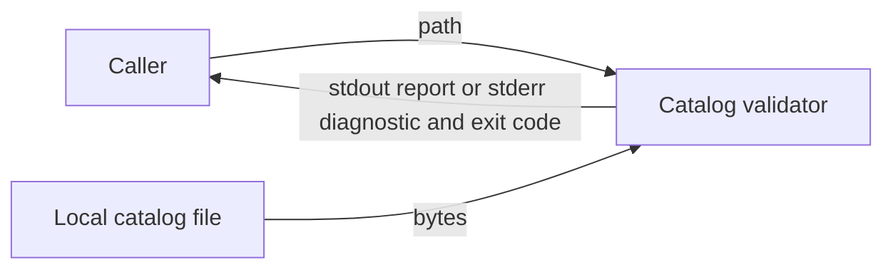
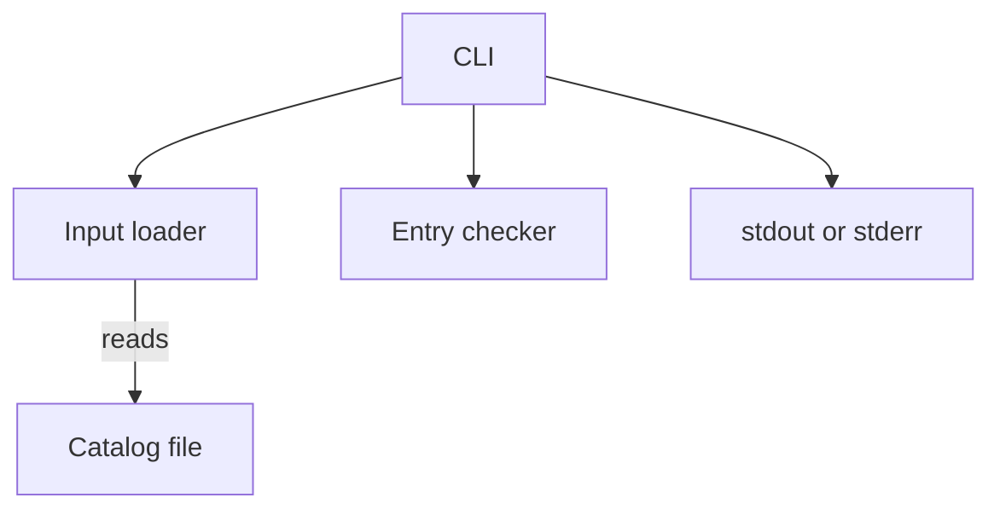

# Catalog Validator Design

Teaching example: this is a fictional system with the requirements below assumed accepted.
It demonstrates document form, not an inspected repository or measured implementation.
The companion worked plan is bundled with the `implementation-planning` skill; locate that skill
through the available skill catalog rather than assuming a neighboring installation path.

Status: accepted within this example; once implemented, the code wins and this design follows it.
Format: arc42; no repository design convention exists. Open items: none.

## 1. Introduction and Goals

### 1.1 Requirements Overview

A catalog maintainer needs to check entry identifiers before publishing a catalog. The validator
reads one local file and reports problems without changing the source.

The example's accepted requirements are:

| Requirement       | Observable behavior                                                                                                                            |
| ----------------- | ---------------------------------------------------------------------------------------------------------------------------------------------- |
| R1: Input         | Accept exactly one path to a UTF-8 file containing a JSON array.                                                                               |
| R2: Identifiers   | Every array entry must be an object with a nonempty string `id`. Identifiers must be unique. Other properties are allowed.                     |
| R3: Reporting     | Report all entry issues in input order as one JSON object on stdout. Exit 0 for valid entries and 1 for entry issues.                          |
| R4: Input failure | For invalid invocation, an unreadable file, invalid UTF-8, invalid JSON or a non-array root, exit 2 with a diagnostic on stderr and no stdout. |
| R5: Preservation  | Never write to the input file. The tool makes no network requests.                                                                             |

### 1.2 Quality Goals

Correctness and source preservation drive the design. A catalog with several invalid entries must
report all their issues (R2, R3), and a failed check must leave the input unchanged (R5). No
throughput or file-size target is accepted.

### 1.3 Stakeholders

The maintainer needs actionable entry locations. A build process needs stable JSON output and exit
codes so it can stop publication when the catalog is invalid.

## 2. Architecture Constraints

The program runs locally as `catalog-check PATH`. Its JSON parser must reject malformed JSON
rather than interpreting it as an empty catalog.

## 3. Context and Scope

The caller supplies a path; the local filesystem supplies bytes. The caller receives a report or
an input diagnostic. Publication itself remains outside this tool.



The filesystem interaction is read-only. Successful reads form one input snapshot for the check;
the tool does not promise to detect another process changing the file afterward.

## 4. Solution Strategy

Separate input handling, entry checking and command-line reporting. Entry checking operates on
parsed values, so it can inspect every entry without filesystem access. The command-line layer
distinguishes input failures from catalog issues before producing output.

Read and parse before checking any entries. This prevents a malformed document from yielding a
partial report that a caller might mistake for a complete check.

## 5. Building Block View

### 5.1 Overall Structure



| Component     | Responsibility and interface                                                                                       |
| ------------- | ------------------------------------------------------------------------------------------------------------------ |
| CLI           | Validates invocation, calls the loader and checker, serializes the report, and selects streams and exit codes.     |
| Input loader  | Reads and decodes the file, parses JSON and requires an array root. Returns entries or a classified input failure. |
| Entry checker | Accepts an array and returns an ordered list of issues. It performs no I/O.                                        |

This separation gives the checker a deterministic input while keeping every external effect in
the loader or CLI. Reporting remains in the CLI because stream selection and exit status form one
caller-facing contract.

## 6. Runtime View

### 6.1 Valid or Invalid Entries

1. The CLI checks that the caller supplied one path.
2. The input loader reads and parses that file and returns its array.
3. The entry checker visits entries in ascending index order and collects issues.
4. The CLI writes one report followed by a newline. It exits 0 when the issue list is empty, otherwise 1.

For `[{"id":"oak"},{"id":"oak"},{}]`, the report is:

```json
{"valid":false,"issues":[{"index":1,"code":"duplicate_id"},{"index":2,"code":"invalid_id"}]}
```

The checker reports the later duplicate, so the maintainer can locate the entry that conflicts
with an earlier identifier.

### 6.2 Input Failure

If reading, decoding or parsing fails, the loader returns an input failure to the CLI. A non-array
root follows the same path. The CLI writes a diagnostic on stderr and exits 2 without invoking
the checker or emitting a report. The caller corrects the input and runs the command again;
there is no automatic retry.

## 7. Deployment View

One local process runs the CLI, loader and checker. The tool requires read access to the supplied
file and access to the caller's output streams. It needs no service, database or network connection.
There is no persistent state to migrate or recover.

## 8. Crosscutting Concepts

### 8.1 Identifier and Issue Semantics

Indices are zero-based. A non-object entry yields `entry_type`. An object whose `id` is missing,
not a string, or empty yields `invalid_id`. Each such entry produces one issue and contributes no
identifier to duplicate detection.

Valid identifiers use exact, case-sensitive string equality without trimming or normalization.
Each later occurrence of an identifier yields `duplicate_id`. The first occurrence adds no issue.
This rule bounds each entry to at most one issue and preserves input order.

### 8.2 Output Contract

The report contains `valid` and `issues`; `valid` is true exactly when `issues` is empty.
Each issue contains only `index` and `code`. Report outcomes leave stderr empty.
An empty catalog is valid. Object-key order and JSON whitespace are not part of the contract;
array order, field values, the final newline and exit status are.

Input diagnostics identify the failure class without a traceback or the file's contents.
No component opens the input for writing, even when validation fails.

## 9. Architecture Decisions

The example accepts an in-memory checker because the whole document must parse before a complete
report is possible and no large-file target is supplied. A streaming design would need additional
parsing and failure semantics without serving an accepted requirement here.

Duplicate detection retains the first occurrence and reports later ones. This gives each reported
entry a direct reason for correction while keeping issue order tied to input order.

## 10. Quality Requirements

A catalog containing a non-object, an invalid identifier and a later duplicate reports each
affected index with its code, rather than stopping at the first invalid entry (R2, R3). After
both a passing and a failing check, the input's bytes are unchanged and no write was attempted (R5).

## 11. Risks and Technical Debt

Reading the whole file makes memory use depend on input size. If large catalogs become required,
the input model and reporting guarantees need reconsideration before adding streaming.

Concurrent external changes are outside the snapshot guarantee in section 3. A publication system
that needs validation tied to an immutable artifact must supply that artifact.

## 12. Glossary

| Term          | Meaning                                                                                   |
| ------------- | ----------------------------------------------------------------------------------------- |
| Catalog       | The JSON array supplied to the validator.                                                 |
| Entry issue   | A violation found inside a successfully parsed catalog, reported with an index and code.  |
| Input failure | A condition preventing the tool from obtaining a catalog, reported on stderr with exit 2. |

## Planning Handoff

Preserve the distinction between input failures and entry issues, exact identifier equality,
ordered complete reporting and the prohibition on input writes. These obligations need both
component-level and command-line verification. No product or architecture decision remains open
within the example's stated scope.

---

The arc42 structure is adapted from Gernot Starke and Peter Hruschka under
[CC BY-SA 4.0](https://creativecommons.org/licenses/by-sa/4.0/).
The fictional catalog design and teaching material were written by Joonas Onatsu.
This example is distributed under CC BY-SA 4.0; see [attributions](../ATTRIBUTIONS.md).
